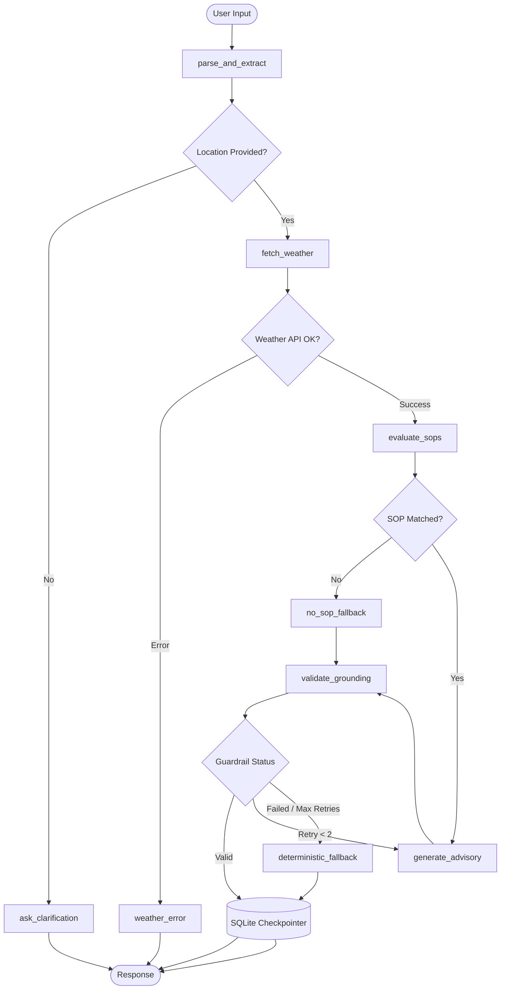

# 🌦️ MediBuddy: Clinical Weather-Advisory System

[](https://www.python.org/downloads/)
[](https://github.com/langchain-ai/langgraph)
[](https://github.com/langchain-ai/langchain)
[](https://streamlit.io/)
[](LICENSE)

**MediBuddy** is an enterprise-grade, agentic clinical weather-advisory platform designed to generate medically grounded, context-aware health advisories based on real-time meteorological conditions, demographic vulnerabilities, and activities. Powered by **LangGraph**, it executes strict deterministic rule matching alongside multi-provider LLM reasoning, backed by automated grounding guardrails and multi-turn SQLite session persistence.

---

## 🌟 Key Features

- **🧭 LangGraph State Machine Orchestration**: Deterministic state machine managing query parsing, entity extraction, weather condition checking, clinical SOP matching, and grounding validation.
- **🛡️ Strict Clinical SOP Rule Engine**: Matches patient profiles and weather parameters against medical Standard Operating Procedures (`data/sops.json`) with citation tracking.
- **🔍 Multi-Turn Session Persistence**: Robust SQLite checkpointing engine (`data/medi_state.db`) supporting multi-turn conversation memory, branching, and session management.
- **🌦️ Real-Time Weather Integration**: Live geolocation and weather forecasting powered by the Open-Meteo API (temperature, humidity, precipitation, UV index, wind speed, air quality).
- **✅ Grounding & Guardrail Verification**: Self-correcting loop that validates LLM-generated output against retrieved weather data and clinical SOP citations to eliminate hallucinations.
- **🔌 Multi-Provider LLM Support**: Native plug-and-play support for Google Gemini, OpenAI, Anthropic Claude, Groq, and a 100% deterministic rule-based fallback mode.
- **💻 Enterprise Streamlit Interface**: Clean, clinical-themed dual-pane interface with conversation history, live execution trace inspection, and SOP browser.

---

## 🏗️ Architecture & Workflow



---

## 📁 Repository Structure

```
MediBuddy/
├── data/
│   ├── medi_state.db          # SQLite database for persistent session storage
│   └── sops.json              # Clinical Standard Operating Procedures library
├── frontend/
│   └── app.py                 # Streamlit clinical web application
├── src/
│   ├── __init__.py
│   ├── config.py              # Pydantic environment & app configuration
│   ├── db.py                  # SQLite checkpointer and session persistence helpers
│   ├── graph.py               # LangGraph state graph assembly & execution runner
│   ├── llm.py                 # Multi-provider LLM factory & client initialization
│   ├── nodes.py               # Graph node implementations & conditional routers
│   ├── sop_engine.py          # Clinical SOP rule matcher and evaluator
│   ├── state.py               # TypedDict state definition for LangGraph
│   └── weather.py             # Open-Meteo API client & geocoding handler
├── tests/
│   ├── conftest.py            # Pytest fixtures and mock setup
│   ├── eval_suite.py          # End-to-end evaluation benchmark suite
│   ├── test_graph.py          # State graph node and routing unit tests
│   ├── test_sop_engine.py     # SOP rule matching unit tests
│   └── test_weather.py        # Weather API parsing and error handling tests
├── .env.example               # Template for environment variables
├── .gitignore                 # Git ignore rules
├── pytest.ini                 # Pytest configuration
├── requirements.txt           # Python dependencies
└── README.md                  # Project documentation
```

---

## 🚀 Getting Started

### Prerequisites
- Python 3.10 or higher
- Git

### 1. Clone the Repository
```bash
git clone https://github.com/your-username/MediBuddy.git
cd MediBuddy
```

### 2. Set Up a Virtual Environment
```bash
# Windows
python -m venv .venv
.venv\Scripts\activate

# macOS / Linux
python3 -m venv .venv
source .venv/bin/activate
```

### 3. Install Dependencies
```bash
pip install --upgrade pip
pip install -r requirements.txt
```

### 4. Configure Environment Variables
Copy `.env.example` to `.env` and configure your API keys:
```bash
cp .env.example .env
```

Edit `.env` with your preferred configuration:
```ini
# LLM Provider: "gemini", "openai", "anthropic", "groq", or "deterministic"
LLM_PROVIDER=gemini

# API Key for chosen provider
GOOGLE_API_KEY=your_gemini_api_key_here
OPENAI_API_KEY=your_openai_api_key_here
ANTHROPIC_API_KEY=your_anthropic_api_key_here
GROQ_API_KEY=your_groq_api_key_here

# Model Selection
MODEL_NAME=gemini-2.0-flash

# Temperature (keep at 0.0 for deterministic clinical reasoning)
LLM_TEMPERATURE=0.0

# Path to SOP rules
SOPS_FILE_PATH=data/sops.json
```

---

## 🖥️ Running the Application

### Launch Streamlit Frontend
```bash
streamlit run frontend/app.py
```
Open your browser at `http://localhost:8501`.

### Interactive Features:
- 💬 **Live Health Advisory Chat**: Enter natural language queries (e.g., *"I have asthma and want to go for a run in Delhi tomorrow morning"*).
- 📜 **Full Execution Traces**: View node-by-node execution details, extracted entities, matched weather metrics, and grounding status.
- 🗂️ **Multi-Session Management**: Create new sessions, switch between historical chats, or delete sessions directly from the sidebar.
- 📑 **SOP Rule Browser**: Inspect loaded clinical rules, target conditions, thresholds, and citations.

---

## 🧪 Testing & Evaluation

Run the automated unit tests and test suites using `pytest`:

```bash
# Run all unit tests
pytest

# Run tests with detailed verbose output
pytest -v

# Run the comprehensive evaluation benchmark suite
python -m tests.eval_suite
```

---

## 📋 Standard Operating Procedures (SOPs)

Clinical guidelines are defined declaratively in `data/sops.json`. Each SOP specifies:
- **`sop_id` & `title`**: Identifier and human-readable title.
- **`target_demographics`**: Target groups (e.g., `asthma`, `elderly`, `cardiovascular`, `children`).
- **`weather_triggers`**: Trigger thresholds for temperature, humidity, UV index, air quality, etc.
- **`clinical_advisory`**: Evidence-based action items, precautions, and symptom monitoring recommendations.
- **`citation`**: Official medical or meteorological guideline source.

---

## 🔒 Safety & Disclaimer

> [!CAUTION]
> **MediBuddy is an informational decision-support demonstration tool.** It is **not** a certified medical diagnostic device and does not substitute for professional medical diagnosis, advice, or treatment. Always consult qualified healthcare professionals for medical emergencies and clinical conditions.